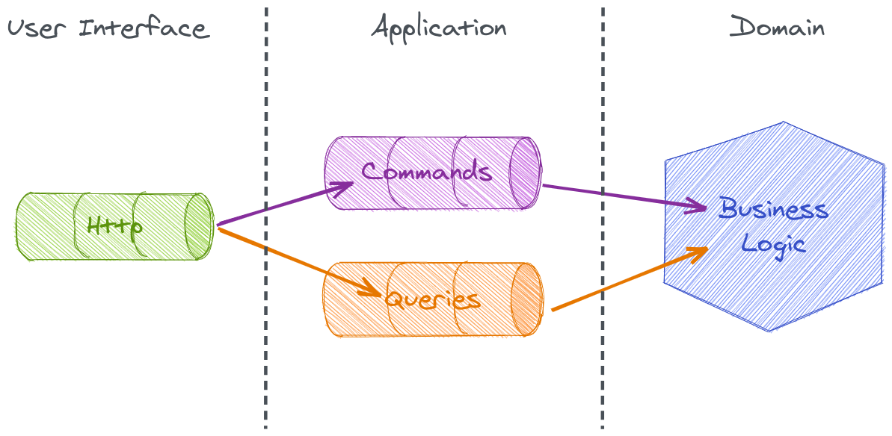

# Overview

In a very high level, an application implemented using Chimera looks like this: 

Translating that into words, our architecture is composed by 3 different pipelines:

1. **HTTP**: responsible for converting HTTP requests into commands/queries and creating HTTP responses from query results
1. **Command (bus)**: responsible for processing write operations
1. **Query (bus)**: responsible for processing read operations

## Wait, isn't this CQRS?

Well, not really... but you're close!

In [Martin Fowler's words](https://www.martinfowler.com/bliki/CQRS.html), CQRS is:

> CQRS stands for Command Query Responsibility Segregation.
> It's a pattern that I first heard described by [Greg Young](https://twitter.com/gregyoung).
> At its heart is the notion that you can use a different model to update information than the model you use to read information.

The fact we use service buses for processing commands and queries doesn't mean we have CQRS.
What determines that is the usage of different models to perform the actions.

With this structure, Chimera enables users to decide if and when they want to apply CQRS in parts of their software, without having to change too much.

## How does Chimera work?

Chimera uses configuration to define how the software works - so, no magic convention happens here.
Users can map middleware for all the pipelines, define the handlers for their commands/queries, and expose command/query handlers to the HTTP layer.

The configuration is put together during the compilation of the Dependency Injection Container.
So, we optimise the wiring as much as possible to make your application's bootstrapping faster.

### Do I really have to use the service buses?

Not at all!
It's completely possible to only use Chimera to map custom request handlers and HTTP middleware, bypassing the whole service bus feature.

In other words, you're free to define how application works.
Chimera is here to support your choices, not dictate things.
